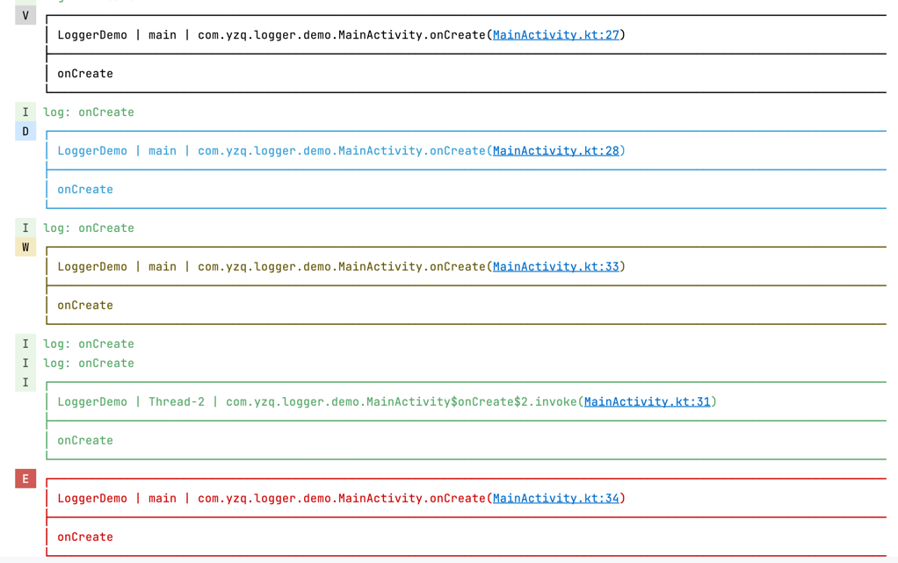

# logger

小而美的日志打印组件

# 使用方式

**添加依赖**

```kotlin
implementation("com.xeonyu:logger:1.0.4")
```

**代码示例**

```kotlin
/*添加观察者*/
Logger.addObserver(object : LogObserver {
    override fun log(info: LogInfo) {
        println("log: ${info.msg}")
    }
})

/*打印*/
Logger.v("onCreate")
Logger.d("onCreate")
/*子线程打印*/
thread {
    Logger.i("onCreate")
}
Logger.w("onCreate")
Logger.e("onCreate", tr = Exception("data error"))
/*打印json*/
Logger.json(JSONObject().put("name", "yuzhiqiang").put("age", 18).toString())
```

控制台显示如下：
第一行分别是 TAG，线程名，代码位置


