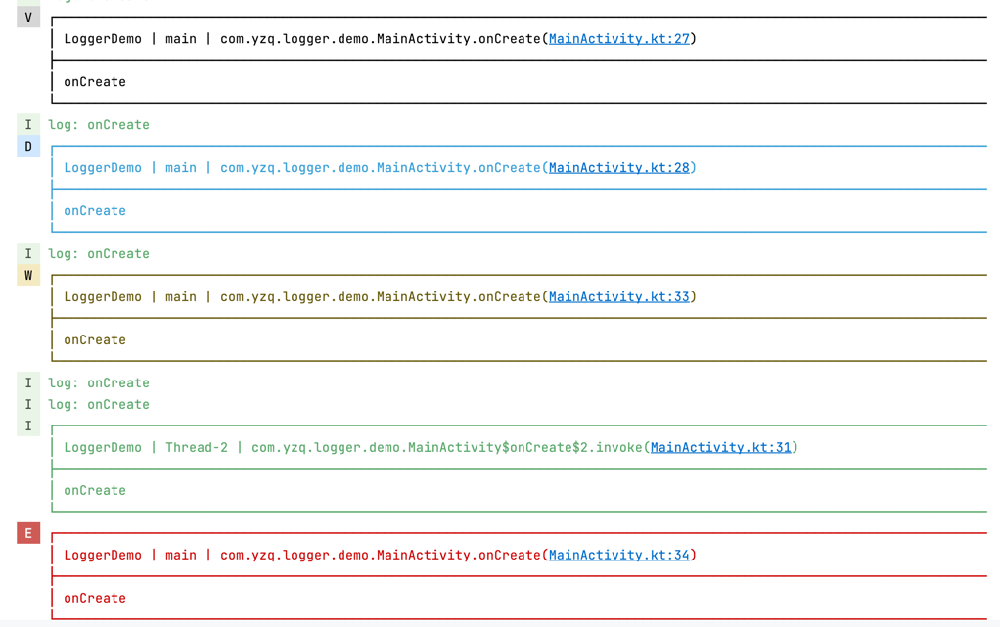

# Logger

[](https://central.sonatype.com/artifact/com.xeonyu/logger)

**Logger** 是一个简单、强大且高度可定制的 Android 日志打印库。它旨在提供清晰的日志输出，便于调试和排查问题。



## 特性

- **多输出端支持**：支持同时打印日志到控制台（Logcat）、本地文件和可视化界面。
- **格式化输出**：自动格式化 JSON，支持显示 Tag、线程信息、调用栈信息。
- **美化打印**：控制台日志支持边框包裹，清晰易读；由 `Logcat` 长度限制自动换行。
- **文件日志**：支持自定义日志路径、文件大小轮转、过期自动清理。
- **可视化界面**：内置 `ViewPrinter`，可在 App 内直接查看日志，支持按等级、关键字筛选。
- **简单易用**：链式配置，API 简洁，支持多参数打印。

## 引入

最新版本请查看: [](https://central.sonatype.com/artifact/com.xeonyu/logger)

在你的模块 `build.gradle` 中添加依赖：

```kotlin
dependencies {
    implementation("com.xeonyu:logger:x.x.x")
}
```

## 使用指南

### 1. 初始化

建议在 `Application` 的 `onCreate` 中进行初始化。你可以按需组合不同的 Printer（打印器）。

```kotlin
class App : Application() {
    override fun onCreate() {
        super.onCreate()

        // 1. 配置控制台打印器
        val consoleLogPrinter = ConsoleLogPrinter.getInstance(
            ConsoleLogConfig.Builder()
                .enable(true)           // 是否启用
                .showStackTrace(true)   // 显示堆栈信息
                .showThreadInfo(true)   // 显示线程信息
                .showBorder(true)       // 显示边框
                .lineLength(1000)       // 每行最大长度
                .tag("GlobalTag")       // 默认全局 Tag
                .build()
        )

        // 2. 配置文件打印器
        val fileLogPrinter = FileLogPrinter.getInstance(
            FileLogConfig.Builder()
                .enable(true)
                .writeLogInterval(10)   // 写入间隔 (条)
                .logCapacity(100)       // 内存缓存容量
                .memoryCacheSize(100)
                .build()
        )

        // 3. 配置可视化界面打印器
        val viewLogPrinter = ViewLogPrinter.getInstance(
            ViewLogConfig.Builder()
                .enable(true)
                .showStackTrace(false)
                .showThreadInfo(true)
                .cacheSize(1000)        // 缓存条数
                .build()
        )

        // 4. 初始化 Logger 并添加打印器
        Logger.init(this, BuildConfig.DEBUG)  // 初始化，传入 Application 和调试模式标志
            .addPrinter(consoleLogPrinter)
            .addPrinter(fileLogPrinter)
            .addPrinter(viewLogPrinter)
    }
}
```

### 2. 基本打印

`Logger` 支持多种参数类型，包括基础类型、对象、集合等。

```kotlin
// 只有 Tag 和 内容
Logger.i("MainActivity", "这是一个普通日志")

// 自动解析对象 (会调用 toString 或特定格式化)
val user = User("Tom", 18)
Logger.d("UserTag", user)

// 多参数打印
Logger.w("MultiTag", "Param1", 123, true, listOf("A", "B"))

// 打印异常 (Throwable 会自动被识别)
try {
    // ...
} catch (e: Exception) {
    Logger.e("ErrorTag", "发生错误", e)
}
```

### 3. JSON 打印

`Logger.json` 方法会自动格式化 JSON 字符串，使其在 Logcat 中易于阅读。

```kotlin
val jsonStr = "{\"name\": \"Logger\", \"type\": \"Android Library\"}"
Logger.json("JsonTag", jsonStr)
```

### 4. App 内查看日志

通过 `ViewLogPrinter`，你可以在 App 运行时直接唤起日志查看页面，无需连接电脑查看 Logcat。

```kotlin
// 跳转到日志查看页面
Logger.showLogInfoPage()
```

该页面功能：

- **等级筛选**：只看 Error 或 Debug 等级。
- **搜索**：按关键字过滤。
- **清理**：一键清屏。
- **复制**：长按条目复制日志内容。

## 🛠 配置说明

### ConsoleLogConfig (控制台)

| 方法                        | 描述        | 默认值        |
|---------------------------|-----------|------------|
| `enable(Boolean)`         | 是否开启控制台打印 | `true`     |
| `showStackTrace(Boolean)` | 是否显示方法调用栈 | `false`    |
| `showThreadInfo(Boolean)` | 是否显示线程信息  | `false`    |
| `showBorder(Boolean)`     | 是否显示美化边框  | `true`     |
| `tag(String)`             | 默认的全局 Tag | `"Logger"` |

### FileLogConfig (文件)

| 方法                      | 描述                   |
|-------------------------|----------------------|
| `enable(Boolean)`       | 是否开启文件写入             |
| `logCapacity(Int)`      | 单个日志文件最大容量（达到后自动轮转）  |
| `writeLogInterval(Int)` | 批量写入阈值（积累多少条日志后写入文件） |
| `memoryCacheSize(Int)`  | 内存缓存大小               |

### ViewLogConfig (可视化)

| 方法                        | 描述                      |
|---------------------------|-------------------------|
| `enable(Boolean)`         | 是否开启可视化记录               |
| `cacheSize(Int)`          | UI 列表保留的最大日志条数 (防止内存溢出) |
| `showStackTrace(Boolean)` | 是否在 UI 中显示调用栈           |
| `showThreadInfo(Boolean)` | 是否在 UI 中显示线程信息          |

## 贡献

欢迎贡献代码！如果你发现了 bug 或者有新的功能建议，请：

1. [创建 Issue](https://github.com/yuzhiqiang1993/logger/issues)
2. [创建 Pull Request](https://github.com/yuzhiqiang1993/logger/pulls)

## 许可证

本项目采用 [Apache License 2.0](LICENSE) 许可证。

---


如果这个项目对您有帮助，请给个 ⭐️ Star 支持一下！
